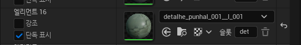

# [개인 프로젝트2 : KillTheBoss]

# <프로젝트 기획>

## [구현할 기능]

### <Player>

- **컨트롤**
    - 앞뒤좌우, 웅크리기, 웅크리고 움직이기
        - 점프는 구현하지 않을 예정 → 갈 수 있는 곳과 못 가는 곳 명확한 구분을 위해
    - (예정)(미정) 구르기 기능 고민 필요
    - (예정) 근접 공격
    - (예정) 암살 공격
- **공격**
    - 권총 사격
    - (예정) 근접 공격 (주먹)
        - 마지막에 가능하면 구현 IK 관련 알아야할 것들이 있음
    - (예정) 암살 공격
        - 마지막에 가능하면 구현 IK 관련 알아야할 것들이 있음
    - (예정) 밀기 (높은 층수에서 밀어서 떨어뜨리기)
        - 마지막에 가능하면 구현 IK 관련 알아야할 것들이 있음
    
    ⇒ Full body IK(Inverse Kinematic)에 대해서 공부 필요
    
- **기타 행동**
    - 동전이나 공 같은 작은 물건 던지기 → Enemy 주의를 끌어서 들키지 않고 이동 가능하게 만들기
    - 레벨에 배치된 버튼 조작 → 압착기 가동 or 구조물 떨어뜨리기 등
    - (예정) 처치한 적 끌어서 이동하기
        - IK or Enemy mesh 교체 etc.

### <Enemy>

- **컨트롤**
    - AI_Controller 사용
- **상태**
    - **Patrol [Default]**
        - Speed - Low
        - Anim - Idle_Stand, Idle_Walk, Idle_LookAround
        
         ⇒ 다른 상태로 전환할 때 Enemy 머리위에 ’ ! ‘ 같은 문자 띄워줘도 좋을 것 같음
        
        → 플레이어가 본인이 들켰는지 자각용
        
    - **Aggresive Patrol [(총격, 폭발음 감지 OR 시신 발견) AND 플레이어 발견 못 함]**
        - Speed - Medium
        - Anim - AggresivePatrol_Walk, AggresivePatrol_LookAround
        
        ⇒ Question Mark
        
    - **Suspicion [시야 내에 플레이어 존재 && 시야 내에 플레이어 지속 2초 이내]**
        - **Patrol+** (Patrol에 몇 가지 b변수 추가로 상태 전환)
        - Anim - Idle_ScratchHead(변경 가능)
        
        ⇒ Question Mark
        
    - **Combat [시야 내에 플레이어 존재 && 시야 내에 플레이어 지속 2초 이상]**
        - Speed - Medium(Walk) → Fast(Run)
        - Enemy_Unarmed(미정)
            - Anim - Combat_Stand, Combat_Walk(플레이어 미발견), Combat_Run(플레이어 발견), Combat_Punch
        - Enemy_Armed
            - Anim - Combat_ArmedStand, Combat_ArmedWalk(플레이어 미발견), Combat_ArmedRun(플레이어 발견), Combat_ArmedShoot
        
        ⇒ Exclamation Mark
        
        ⇒ 플레이어를 놓치고 10초간 주위를 배회한 뒤 다시 Patrol State로 변경 
        
- **공격**
    - 권총 사격
    - (예정) 근접 공격 (주먹)
        - 마지막에 가능하면 구현 IK 관련 알아야할 것들이 있음
- **행동**
    - **Default** (Patrol State : 스폰한 층만 이동)
        - 각 개체별 지정된 타깃 포인트 순회하며 이동
        - 각 타깃 포인트에서 잠시 멈추며 주위 둘러보는 애니메이션 재생
    - **플레이어 발견 시** (Patrol State → Sus State → Combat State)
        - Enemy 시야 범위 내에(Suspicion State On) 2초 이상 머무를 시 쫒아와서 공격 시작
        - Unarmed Enemy는 주먹 공격 / Armed Enemy는 사격 공격
    - **Enemy 시신 발견 시** (Patrol State →  Aggresive Patrol state)
        - Enemy 시야 범위 내에 Enemy 시신 발견 시 Combat 상태가 되며 주변 수색
    - **총격 사운드 감지 시** (Patrol State → Aggresive Patrol state)
        - 총격 사운드 범위 내에 있는 모든 Enemy는 총격 사운드가 플레이된 위치로 모두 달려감

### <Boss>

- **Enenmy+**
- Anim - Idle_Sitting
- Patrol - 여러 층 번갈아가며 움직임(Idle_Wait 좀 더 길게 가져감)

- **상태**
    - **Patrol [Default]**
        - Speed - Low
        - Anim - Idle_Stand, Idle_Walk, Idle_LookAround(**좀 더 길게**)
    - **Aggresive Patrol [(총격, 폭발음 감지 OR 시신 발견) AND 플레이어 발견 못 함]**
        - Speed - Medium
        - Anim - AggresivePatrol_Walk, AggresivePatrol_LookAround
    - **Combat [시야 내에 플레이어 존재]**
        - Speed - Medium
        - Enemy_Armed
            - Anim - Combat_ArmedStand, Combat_ArmedRun, Combat_ArmedShoot
- **행동**
    - **Default** (Patrol State : 여러 층과 장소에 타깃 포인트 설정)
        - 각 개체별 지정된 타깃 포인트 순회하며 이동
        - 각 타깃 포인트에서 잠시 멈추며 주위 둘러보는 애니메이션 재생
    - **플레이어 발견 시** (Patrol State → Combat State)
        - Enemy 시야 범위 내에(Suspicion State On) 2초 이상 머무를 시 쫒아와서 공격 시작
        - Unarmed Enemy는 주먹 공격 / Armed Enemy는 사격 공격
    - **Enemy 시신 발견 시** (Patrol State →  Aggresive Patrol state)
        - Enemy 시야 범위 내에 Enemy 시신 발견 시 Combat 상태가 되며 주변 수색
    - **총격 사운드 감지 시** (Patrol State → Aggresive Patrol state)
        - 총격 사운드 범위 내에 있는 모든 Enemy는 총격 사운드가 플레이된 위치로 모두 달려감

## [레벨 구성]

- **Start Point**
    - 건물의 입구에서

## [오브젝트]

**<플레이어가 소지 및 사용>**

- **Coin**
    - 적을 유인하는 용도
        - Enemy의 좁은 반경 내(같은 층에만 적용)에 떨어지면 Enemy가 그 쪽으로 이동함
    - 다시 주워서 사용 가능
- **Bouncy Ball**
    - 적을 유인하는 용도
        - Enemy의 좁은 반경 내(같은 층에만 적용)에 떨어지면 Enemy가 그 쪽으로 이동함
    - 다시 주워서 사용 가능

**<플레이어와 상호 작용>**

- **Explosive Barrel**
    - 총을 쏴서 맞추면 일정 반경에 폭파
        - 중간 반경 내에 Enemy, Player 있으면 사망처리
        - 넓은 반경 내에 있는
- 

## [사용할 에셋 목록]

### <캐릭터>

[https://www.mixamo.com/#/?page=1&type=Character](https://www.mixamo.com/#/?page=1&type=Character)

- 주인공 : Leonardo, Brian
- 적 :  Adam
- 보스 : Crypto

⇒ Mixamo 캐릭터들 옷 텍스처 변경해서 새로 제작 가능한지 확인해보기

### <오브젝트>

### <애니메이션>

- **암살 모션** : [https://www.mixamo.com/#/?page=1&query=assasin](https://www.mixamo.com/#/?page=1&query=assasin)
- **Actorcore(유료 애니메이션 모음)** - [https://actorcore.reallusion.com/3d-motion?orderBy=Relevance&keyword=push](https://actorcore.reallusion.com/3d-motion?orderBy=Relevance&keyword=push)
    - R05 Cradle Drop Drag M (+ Group Motsion)
- **~~app.anything.world(AI 기본 애니메이션 붙여주기)** - [https://app.anything.world/u/my-world/my-models](https://app.anything.world/u/my-world/my-models)~~ ⇒ 쓸게 못 됨

## [해결해야 할 것들]

1. Static Mesh와 Skeleton Mesh의 차이점
    
    → Static Mesh는 절대 안움직은 애(동상이나 못 움직이는 건물 등) / Skeleton Mesh : 뼈대(Skeleton)와 Mesh 정점이  합쳐져 있는 것(무겁다 → 게임 내에서 반드시 움직임이 구현되어야 하는 애들만 사용)
    
2. Skeleton Mesh와 Skeleton의 차이점
    
    → 뼈대에 Mesh가 붙어있는냐 아니냐
    
3. Skeleton Mesh와 Skeleton 중 어떤 걸 Static Mesh로 만들어야 하는가?
    
    → Skeleton에는 Mesh가 없어요. Skeleton Mesh는 있어요.
    
4. 소캣 만드는 방법
    
    → Skeleton Mesh 파일에 오른쪽 ‘스켈레톤 트리’ 창에서 붙이고 싶은 뼈대에 붙이고 세부 조절 필요
    
5. Unreal 내부에서 텍스처 수정하는 방법 or 필터 적용법
    
    → 구분되어 있지 않으면 방법이 없음. 포토샵 같은 파일로 열어서 수정 후 다시 적용해야함
    

## [에셋 수정 필요한 부분]

<Gun_Untitled>

## [참조 사이트]

- **itch.io** - [https://itch.io/game-assets/tag-3d](https://itch.io/game-assets/tag-3d)
    - Animation Library - [https://quaternius.itch.io/universal-animation-library](https://quaternius.itch.io/universal-animation-library)
- **Sketchfab** - [https://sketchfab.com/features/free-3d-models](https://sketchfab.com/features/free-3d-models)
- **Mixamo** - [https://www.mixamo.com/](https://www.mixamo.com/)
- **모션 워핑(캐릭터 애니메이션 플레이 장소로 이동)** - ****[https://dev.epicgames.com/documentation/ko-kr/unreal-engine/motion-warping-in-unreal-engine?utm_source=chatgpt.com](https://dev.epicgames.com/documentation/ko-kr/unreal-engine/motion-warping-in-unreal-engine?utm_source=chatgpt.com)